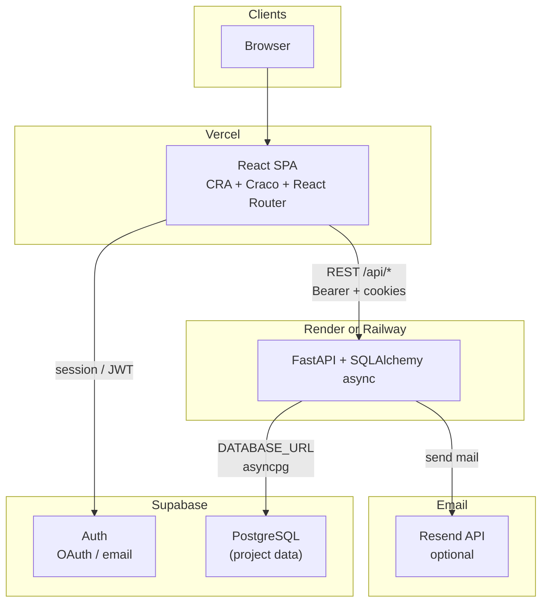
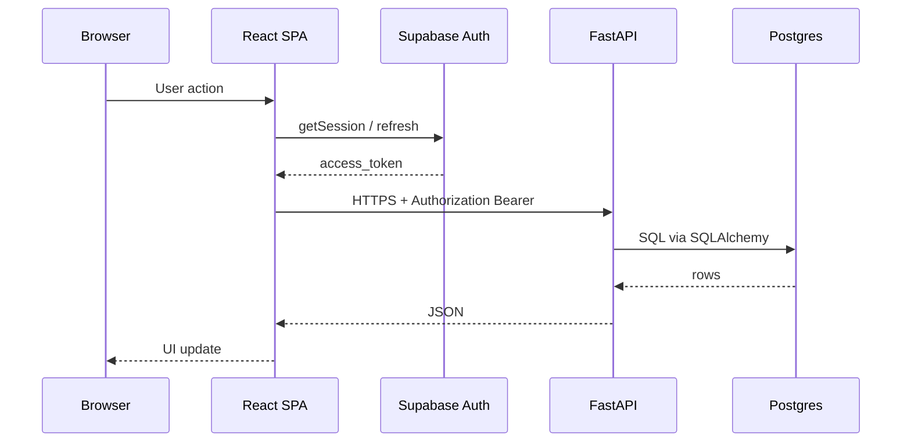

# Architecture diagram — MzansiBuilds

High-level deployment and data flow: **React SPA** on **Vercel**, **FastAPI** on **Render** or **Railway**, **Supabase** for PostgreSQL and (browser-side) Auth; optional **Resend** for transactional email from the API.

## Sequence (typical authenticated request)

## Maintenance notes

- If the frontend stops using Supabase Auth or adds a BFF, redraw the Auth and API arrows accordingly.
- If the API moves to the same host as the SPA (reverse proxy), collapse Vercel + host into one box and label routes.
- Document **environment variables** (`REACT_APP_*`, `DATABASE_URL`, `RESEND_API_KEY`) in [`frontend/.env.example`](../../frontend/.env.example) and [`backend/.env.example`](../../backend/.env.example), not only in this diagram.
