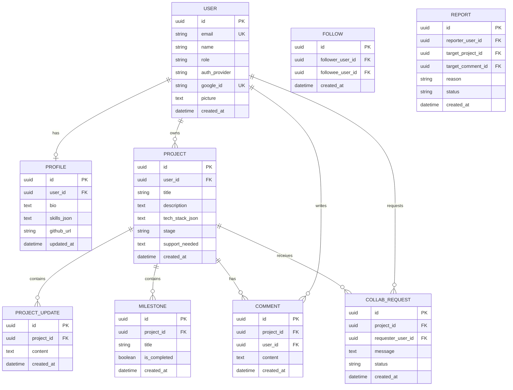

# Entity–relationship diagram — MzansiBuilds

This ERD reflects the **target domain** named in the project brief, aligned with the current SQLAlchemy models where they exist.

**Implemented in code today:** `User`, `Profile`, `Project` (with **Stage** as enum column `stage`, not a separate table), `ProjectUpdate` (domain “Update”), `Milestone`, `Comment`, `CollaborationRequest` (domain “CollabRequest”).  
**Also in DB but out of brief scope:** `UserSession`, `LoginAttempt` — omitted below to keep the diagram readable; add them if you document auth persistence.

**Not implemented yet (keep in diagram for roadmap):** `Follow`, `Report` — shown with dashed relationships; remove or solidify when tables exist.

**Follow** and **Report** appear above as entities for the brief; they are **not wired with edges** yet so the diagram stays valid in Mermaid and matches the current schema (no `follow` / `report` tables). When you add migrations, connect:

- `FOLLOW.follower_user_id` / `followee_user_id` → `USER.id`
- `REPORT.reporter_user_id` → `USER.id`; optional FKs to `PROJECT` / `COMMENT` for the reported target.

## Domain mapping

| Brief name | Code / table |
|------------|----------------|
| Stage | `Project.stage` (`ProjectStage` enum in [`backend/models.py`](../../backend/models.py)) |
| Update | `ProjectUpdate` → table `project_updates` |
| CollabRequest | `CollaborationRequest` → `collaboration_requests` |
| Follow | Not in schema yet — entity reserved above |
| Report | Not in schema yet — entity reserved above |

## Maintenance notes

- When **Follow** or **Report** ships, replace `..` relationships with solid FK lines and update attributes to match migrations.
- If you split **Stage** into its own table, introduce `STAGE` and relate `PROJECT` → `STAGE`.
- Regenerate column lists from Alembic migrations or `models.py` whenever you change fields.
