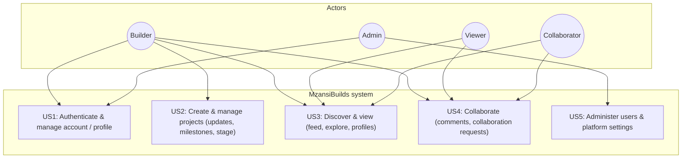

# Use case diagram — MzansiBuilds

Actors map to how people use the product. Use cases are the five user stories requested for profiling; they can be split into smaller use cases over time.

## Actor notes

| Actor | Description |
|-------|-------------|
| **Builder** | Signed-in user who owns projects, posts updates, and maintains a profile. |
| **Viewer** | Authenticated or anonymous user who browses feed, explore, and public project/profile pages. |
| **Collaborator** | User who engages with others’ projects (comments, collaboration requests). Often also a Builder. |
| **Admin** | Elevated role (`role=admin` in backend) for operational tasks; extend for moderation as the product grows. |

## User stories (use cases) — summary

| ID | Use case | Primary actors |
|----|-----------|----------------|
| US1 | Authenticate (Supabase) and manage profile | Builder, Admin |
| US2 | CRUD projects, stage, updates, milestones | Builder |
| US3 | Discover: feed, explore, user/project detail | Builder, Viewer |
| US4 | Comment and request collaboration on projects | Builder, Viewer, Collaborator |
| US5 | Administer accounts / platform | Admin |

## Maintenance notes

- When you add features (e.g. follows, reports), add use cases and wire new actors only if behavior truly differs.
- If “Collaborator” stays behaviorally identical to “Builder,” you may merge them in the diagram and describe collaboration as included use cases under Builder.
